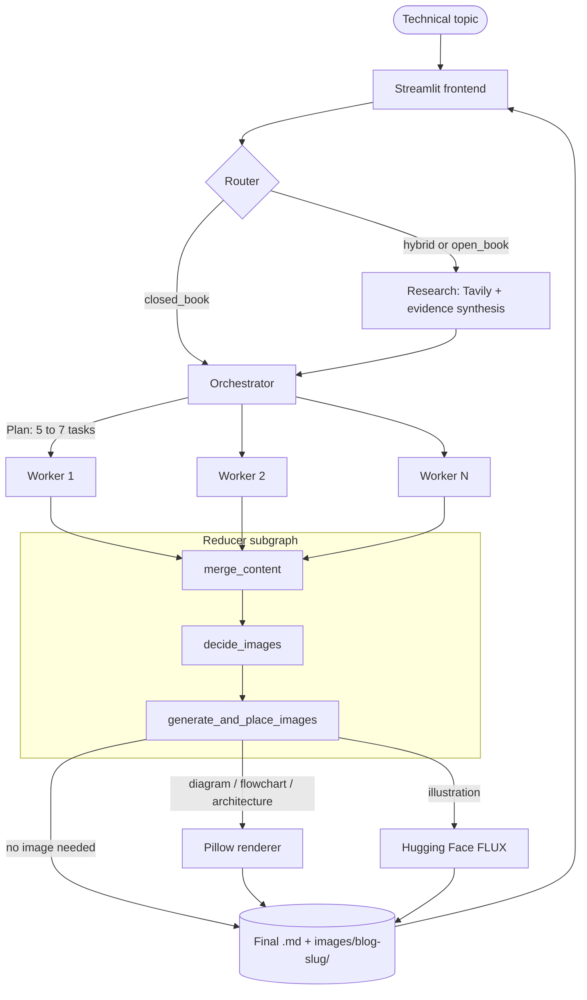
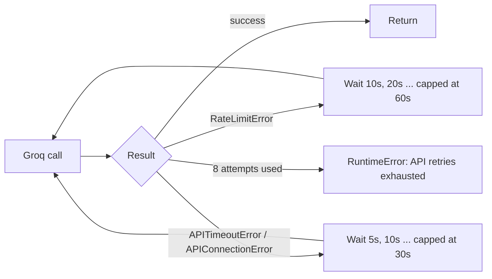

<div align="center">

# ✍️ Agentic Technical Blog Writer

**A multi-agent LangGraph pipeline that researches, plans, writes, illustrates and publishes developer-focused technical blog posts, with a Streamlit control room on top.**


[Quick start](#-quick-start) · [Architecture](#-architecture) · [Rate-limit handling](#-groq-rate-limit-handling-tpm) · [Engineering log](#-engineering-log) · [Troubleshooting](#-troubleshooting)

</div>


---

## Overview

Give it a topic such as

> *How to build a production-ready RAG system with LangGraph*

and it runs a complete editorial workflow instead of a single prompt:

1. **Routes** the topic and decides whether fresh web research is needed.
2. **Researches** with Tavily and distils the results into deduplicated evidence.
3. **Plans** a structured 5–7 section outline (typed with Pydantic).
4. **Writes every section in parallel** through LangGraph's `Send` fan-out.
5. **Merges** the sections and **plans visuals** (maximum 3 per post).
6. **Draws technical diagrams in code** (Pillow) and generates conceptual illustrations with FLUX on Hugging Face.
7. **Saves** the final Markdown and images, and shows everything live in Streamlit.

### Why it is built this way

| Decision | Reason |
|---|---|
| Agent graph instead of one giant prompt | Each node has one job, so output is easier to control, test and debug. |
| Diagrams rendered with Pillow, not an image model | Image models garble text. Programmatic diagrams keep every label exact. |
| Raw draft saved *before* the image stage | A late failure never destroys a finished blog. |
| Retry with back-off around every Groq call | Per-minute token limits become a pause, not a crash. |
| Backend and frontend share one slug rule | Saved files, image paths and downloads always match. |

---

## 📑 Table of contents

- [Architecture](#-architecture)
- [Tech stack](#-tech-stack)
- [Quick start](#-quick-start)
- [Configuration](#-configuration)
- [Usage](#-usage)
- [Image pipeline](#-image-pipeline)
- [Groq rate-limit handling (TPM)](#-groq-rate-limit-handling-tpm)
- [Engineering log](#-engineering-log)
- [Project structure](#-project-structure)
- [Known limitations](#-known-limitations)
- [Troubleshooting](#-troubleshooting)
- [Security notes](#-security-notes)
- [Roadmap](#-roadmap)

---

## 🧠 Architecture



### Nodes and shared state

| Node | Responsibility | Writes to state |
|---|---|---|
| `router` | Chooses `closed_book`, `hybrid` or `open_book`; proposes 3–6 search queries when research is needed | `mode`, `needs_research`, `queries` |
| `research` | Runs Tavily (up to 4 results per query), synthesizes at most 12 deduplicated sources | `evidence` |
| `orchestrator` | Builds the typed `Plan` (title, tone, audience, tasks) | `plan` |
| `worker` ×N | Writes one section each, in parallel; cites only supplied URLs | `sections` |
| `merge_content` | Orders sections, writes `<slug>_raw.md` | `merged_md` |
| `decide_images` | Places `[[IMAGE_n]]` placeholders and specifies up to 3 visuals | `md_with_placeholders`, `image_specs` |
| `generate_and_place_images` | Renders diagrams, calls Hugging Face, writes `<slug>.md` | `final` |

**Router modes**

```text
"Explain self-attention"          → closed_book  (evergreen concept)
"Compare current LLM frameworks"  → hybrid       (needs up-to-date examples)
"Latest AI news this week"        → open_book    (volatile facts)
```

**Planner contract (`Plan` → `Task`)**: every task has `id`, `title`, `goal`, 3–5 `bullets`, `target_words` (120–450), `section_type`, `tags`, `required_research`, `required_citation`, `required_code`. Exactly one section is a `common_mistake`.

**Writer prompt**: engineering voice, concrete APIs and trade-offs, no marketing phrasing, no invented statistics, benchmarks or URLs.

---

## 🛠️ Tech stack

| Layer | Technology |
|---|---|
| Agent orchestration | LangGraph (`StateGraph`, `Send`, subgraphs) |
| LLM | Groq, `openai/gpt-oss-120b` |
| Web research | Tavily (`langchain-tavily`) |
| Structured outputs | Pydantic |
| Technical diagrams | Pillow |
| AI illustrations | Hugging Face Inference Providers, default `black-forest-labs/FLUX.1-schnell` |
| Frontend | Streamlit |
| Configuration | `python-dotenv` |

---

## 🚀 Quick start

> Developed with Python 3.14.

```powershell
# 1. Clone
git clone https://github.com/chauhanhimans7-bot/Agentic-Blog-Writer
cd "Langgraph project"

# 2. Virtual environment
python -m venv .venv
.\.venv\Scripts\Activate.ps1

# 3. Dependencies
pip install -r requirements.txt

# 4. Configuration (then edit .env and add your real keys)
Copy-Item .env.example .env

# 5. Launch the UI
streamlit run app.py
```

<details>
<summary>macOS / Linux</summary>

```bash
python -m venv .venv && source .venv/bin/activate
pip install -r requirements.txt
cp .env.example .env
streamlit run app.py
```

</details>

If PowerShell blocks activation, allow scripts for the current session
(`Set-ExecutionPolicy -Scope Process RemoteSigned`) or call `.venv\Scripts\python.exe` directly.

---

## ⚙️ Configuration

Copy `.env.example` to `.env`:

```env
GROQ_API_KEY_2=your_groq_api_key
TAVILY_API_KEY=your_tavily_api_key
HUGGINGFACEHUB_ACCESS_TOKEN=your_huggingface_token

HF_IMAGE_MODEL=black-forest-labs/FLUX.1-schnell
GENERATE_IMAGES=1
BLOG_BACKEND_MODULE=Blog_writing_agent_Enhanced
```

| Variable | Required | Default | Purpose |
|---|---|---|---|
| `GROQ_API_KEY_2` | ✅ | n/a | Groq LLM calls (router, planner, workers, image planner) |
| `TAVILY_API_KEY` | When research runs | n/a | Web search |
| `HUGGINGFACEHUB_ACCESS_TOKEN` | For illustrations | n/a | Hugging Face image generation |
| `HF_IMAGE_MODEL` | No | `black-forest-labs/FLUX.1-schnell` | Image model id |
| `GENERATE_IMAGES` | No | `1` | `0` skips Hugging Face illustrations (Pillow diagrams still render) |
| `BLOG_BACKEND_MODULE` | No | `Blog_writing_agent_Enhanced` | Backend module the frontend imports |
| `BLOG_PROJECT_ROOT` | No | auto-detected | Override the project folder (frontend sits next to the backend or one level below) |

---

## ▶️ Usage

### Streamlit UI (recommended)

```powershell
streamlit run app.py
```

### Backend only

```powershell
python Blog_writing_agent_Backend.py
```

The `__main__` block invokes the compiled graph with `max_concurrency=2`.

### End-to-end test prompt

```text
Build a production-ready RAG system using LangGraph and explain the complete architecture,
including document ingestion, chunking, embeddings, vector storage, retrieval, reranking,
prompt construction, LLM generation, evaluation, failure handling, observability, and cost
considerations. Include practical Python examples and clearly explain the trade-offs between
different design choices.
```

It exercises every stage: router → research → planner → parallel writers → merge → image planning → diagrams / illustrations → final Markdown.

### Frontend tabs

| Tab | What you get |
|---|---|
| 🧩 **Plan** | Title, audience, tone, constraints, and every section's goal, bullets, target words, type, flags and tags |
| 🔎 **Evidence** | Deduplicated Tavily sources with title, source, date, link and snippet |
| 📝 **Markdown Preview** | Rendered post with local images, math rendering, **Download Markdown** and **Download Blog Bundle** (Markdown + only the images that post uses) |
| 🖼️ **Images** | Planned images and prompts, generated files, un-generated `TODO` placeholders, images ZIP |
| 🧾 **Logs** | Stage events and captured backend output |

Also included: a live stage tracker with writer progress (`3/6 sections`), live metrics (mode, evidence, sections, images planned), a past-blogs loader, and a clear error panel that points to the preserved raw draft when a run fails.

Sample log output:

```text
➡️ router finished
➡️ research finished
➡️ orchestrator finished
[worker] finished section 1: Why retrieval quality decides everything
[rate limit] waiting 10s (attempt 1/8)
[worker] finished section 2: Chunking strategies and their trade-offs
[reducer] raw blog saved to building_a_production_ready_rag_system_raw.md
[diagram] saved images/building_a_production_ready_rag_system/rag_flow.png
[image] saved images/building_a_production_ready_rag_system/cover_illustration.png
```

---

## 🎨 Image pipeline

The planner labels every visual with an `image_type`, and the type decides the renderer:

| `image_type` | Renderer | Why |
|---|---|---|
| `architecture`, `flowchart`, `diagram` | **Pillow**, from a structured `DiagramSpec` (nodes + edges) | Labels and arrows are exact and readable |
| `illustration` | **Hugging Face FLUX** | Conceptual visuals where exact text does not matter |

**Diagram renderer**
- Automatic top-to-bottom layout from the dependency graph, deterministic for the same spec.
- Canvas widens automatically for wide levels; cyclic specs still render, and an invalid spec falls back to a `TODO` comment instead of failing the run.
- Font fallback: Windows Arial → DejaVu → Pillow's scalable default.

**Failure behaviour**
- A failed visual becomes an invisible `<!-- TODO image … -->` or `<!-- TODO diagram … -->` comment holding the prompt, so the Markdown stays clean and the visual can be regenerated later. The Images tab lists these.
- If Hugging Face returns a credit or quota error (`402`, `429`, quota), the remaining illustrations are skipped instead of hammering the API.
- `GENERATE_IMAGES=0` disables only the paid illustration path.

Images are stored per post, so two blogs can never overwrite or reuse each other's files:

```text
images/<blog-slug>/<image-name>.png
```

---

## ⏱️ Groq rate-limit handling (TPM)

Groq enforces a **tokens-per-minute (TPM)** budget (8,000 on this project's account). This pipeline makes many LLM calls, including parallel section writers, so hitting the limit mid-run is normal, not exceptional. Early versions crashed with a `429` partway through a blog.

**The fix:** every Groq call goes through `call_with_retry`, which waits out the limit with a growing delay and then tries again.

```python
def call_with_retry(fn, retries: int = 8):
    """Retry temporary API rate-limit and connection failures."""
    for attempt in range(retries):
        try:
            return fn()

        except RateLimitError:
            wait = min(10 * (attempt + 1), 60)

            print(
                    f"[rate limit] waiting {wait}s "
                    f"(attempt {attempt + 1}/{retries})"
            )

            time.sleep(wait)

        except APITimeoutError:
            wait = min(5 * (attempt + 1), 30)

            print(
                    f"[timeout] waiting {wait}s "
                    f"(attempt {attempt + 1}/{retries})"
            )

            time.sleep(wait)

        except APIConnectionError:
            wait = min(5 * (attempt + 1), 30)

            print(
                    f"[connection] waiting {wait}s "
                    f"(attempt {attempt + 1}/{retries})"
            )

            time.sleep(wait)

    raise RuntimeError("API retries exhausted")
```



| Failure | Wait schedule (attempts 1 → 8) | Worst-case total |
|---|---|---|
| `RateLimitError` (TPM window full) | 10, 20, 30, 40, 50, 60, 60, 60 s | 330 s |
| `APITimeoutError` | 5, 10, 15, 20, 25, 30, 30, 30 s | 165 s |
| `APIConnectionError` | 5, 10, 15, 20, 25, 30, 30, 30 s | 165 s |
| Any other exception | raised immediately, no retry | n/a |

**Where it is applied:** router, evidence synthesis, orchestrator, every worker, and the image planner.

**The exception classes matter.** `ChatGroq` raises the Groq SDK's exceptions (`groq.RateLimitError`, `groq.APITimeoutError`, `groq.APIConnectionError`). An earlier version imported the timeout and connection classes from `openai`, so those errors were never caught and crashed the run instead of retrying. All three now come from `groq`.

### Defence in depth: staying under the limit in the first place

Waiting is the safety net. These settings make it rarely needed:

| Layer | Setting |
|---|---|
| Parallelism | `config={"max_concurrency": 2}`, at most 2 section writers at once |
| Hidden reasoning tokens | `reasoning_effort="low"` (reasoning tokens count toward TPM) |
| Output caps | planner `3000`, worker `1800`, image planner `6000` tokens |
| Prompt size | Tavily snippets cut to 300 chars, ≤ 12 sources to the planner, ≤ 8 to each worker |
| SDK level | `ChatGroq(max_retries=2, timeout=120–180)` underneath `call_with_retry` |

> **Retrying cannot fix an oversized single request.** If one request is larger than the whole per-minute budget, no amount of waiting helps. See [Known limitations](#-known-limitations).

---

## 🧰 Engineering log

Problems found while building and testing the system, and how each was resolved.

| # | Problem | Root cause | Fix |
|---|---|---|---|
| 1 | Timeouts and connection errors crashed runs instead of retrying | Exceptions were imported from `openai`, but Groq raises `groq.*` | Catch the Groq SDK's classes ([details](#-groq-rate-limit-handling-tpm)) |
| 2 | Tokens-per-minute `429`s killed runs | No back-off | `call_with_retry` + concurrency cap + token budgets |
| 3 | A node error could execute the whole graph **three times** | Frontend fell back from `stream()` to `stream()` to `invoke()` | Graph runs exactly once; failures are reported, never silently restarted |
| 4 | UI showed the wrong or a backwards stage | Stage was guessed from state snapshots, and reducer internals were hidden | Consume `updates` + `values` with `subgraphs=True`; node events drive the stage tracker |
| 5 | Backend logs never reached the UI | `print()` output stayed in the backend process | Frontend captures backend stdout into the live log and Logs tab |
| 6 | Saved image path ≠ frontend lookup path | Different filename rules; `(`, `)`, `,` in titles broke Markdown image links | One slug rule (letters, digits, `_`, `-`) used by both sides; the frontend image parser tolerates parentheses in older posts |
| 7 | Images from one blog could be reused by another | Shared `images/` folder plus "skip if file exists" | Per-post folders: `images/<blog-slug>/` |
| 8 | A late failure could lose a finished blog | Content existed only in memory until the end | `<slug>_raw.md` is written before the image stage; the UI points to it on failure |
| 9 | Markdown rendering glitches | Italic paragraphs swallowed as captions; `\[ \]` math not rendered; `TODO` comments leaked into the page | Strict caption detection; LaTeX normalised to `$ $` / `$$ $$` (code fences untouched); HTML comments hidden |
| 10 | Backend import errors showed a raw Streamlit traceback | Import happened inside the run loop | Import checked up front; friendly error with details, then stop |
| 11 | Diagram renderer fragile | Fixed 1600 px canvas, random node order, no Linux/macOS font | Auto-widening canvas, deterministic order, font fallback chain |
| 12 | Streamlit deprecation warnings (and future breakage) | `use_container_width` is deprecated | Argument removed |

---

## 📁 Project structure

```text
Langgraph project/
├── Blog_writing_agent_Enhanced.py   # Backend: LangGraph agent (router → research → planner → workers → reducer)
├── app.py		 # Streamlit UI
│                     
├── images/
│   └── <blog-slug>/                 # Per-post diagrams and illustrations
├── requirements.txt
├── .env.example
├── .gitignore
└── <blog-slug>.md · <blog-slug>_raw.md   # Generated posts
```

**Outputs of a successful run**

```text
building_a_production_ready_rag_system_with_langgraph_in_2026.md        # final post
building_a_production_ready_rag_system_with_langgraph_in_2026_raw.md    # draft saved before images

images/building_a_production_ready_rag_system_with_langgraph_in_2026/
├── rag_architecture.png
├── retrieval_pipeline.png
└── system_flow.png
```

The Markdown references images with **relative paths**, so a downloaded bundle keeps working.

---

## ⚠️ Known limitations

- **The image planner re-emits the whole blog.** `decide_images` sends the merged post to the model and asks for it back with placeholders. For long posts this exceeds the TPM budget. One observed run requested **8,479 tokens against an 8,000 limit** and failed in `decide_images`. The post itself was already written and the raw draft preserved. *Planned fix:* return only image decisions and insertion anchors.
- **Diagram quality depends on the model filling `diagram`.** If the planner returns a technical image without nodes and edges, it becomes a `TODO diagram` comment.
- **Cosmetic diagram limits.** Arrowheads always point downward and back-edges are drawn as straight lines, so keep diagrams top-to-bottom without loops.
- **Illustrations need Hugging Face credits.** When credits run out, illustrations fall back to `TODO` comments; diagrams are unaffected.
---

## 🧯 Troubleshooting

| Symptom | Fix |
|---|---|
| `ModuleNotFoundError` | `pip install -r requirements.txt` inside the activated virtual environment |
| Log shows `[rate limit] waiting …s` | Normal. The TPM window is full and the run resumes automatically ([how it works](#-groq-rate-limit-handling-tpm)) |
| `API retries exhausted` | Eight attempts failed. Wait a minute and re-run, or reduce load (shorter topic, lighter worker model) |
| Groq `Request too large … TPM` | A single request exceeds the budget, usually `decide_images` on a long blog. The raw draft is saved as `<slug>_raw.md` ([limitation](#-known-limitations)) |
| Tavily errors | Check `TAVILY_API_KEY`. A failed query is logged and the others continue |
| Hugging Face image errors | Check `HUGGINGFACEHUB_ACCESS_TOKEN`, `HF_IMAGE_MODEL` and your credits. Set `GENERATE_IMAGES=0` to skip illustrations |
| Hidden `<!-- TODO image … -->` in the Markdown | That image was not generated. Open the Images tab for the prompt; check the log line `[image] … failed` |
| Image not found in preview | Images live in `images/<blog-slug>/`; run Streamlit from the project folder |

---

## 🔐 Security Notes

Do not commit:

```text
.env
```

or any file containing API keys.

The repository should use:

```text
.env.example
```

for configuration documentation.

The frontend also validates local image paths so referenced files remain inside the project root.

Recommended `.gitignore` entries:

```gitignore
.env
.venv/
__pycache__/
```

---

## 📌 Design principles

- **Agentic over monolithic.** `Route → Research → Plan → Write → Merge → Visualize`, with one responsibility per node.
- **Structured outputs where they matter.** Pydantic models for routing decisions, evidence, plans, image specs and diagram nodes/edges.
- **Parallel by default.** Independent sections are written concurrently through `Send`.
- **Graceful degradation.** Rate limits, missing images and failed illustrations never erase finished work.
- **Developer-oriented writing.** Implementation detail, trade-offs, failure modes and honest uncertainty over generic marketing prose.

---

## 🗺️ Roadmap

- [ ] Make `decide_images` return only image decisions and anchors (removes the largest token request).
- [ ] Programmatic validation of `required_code` and `required_citation`.
- [ ] Enforce the 3-image maximum in the schema, not only in the prompt.
- [ ] Per-node timing and token metrics.
- [ ] Automated tests: unit tests with stubbed LLMs, plus real-provider smoke tests in CI.
- [ ] Deployment configuration for the Streamlit frontend.

---

## 👨‍💻 Author

Built as a hands-on **agentic AI** project covering LangGraph orchestration, parallel agents, structured outputs, web-grounded generation, programmatic diagrams, AI image generation, Streamlit interfaces and production-style API failure handling.

<div align="center">

⭐ **If this project helps you, consider starring the repository and using the architecture as a starting point for your own agentic content workflows.**

</div>
